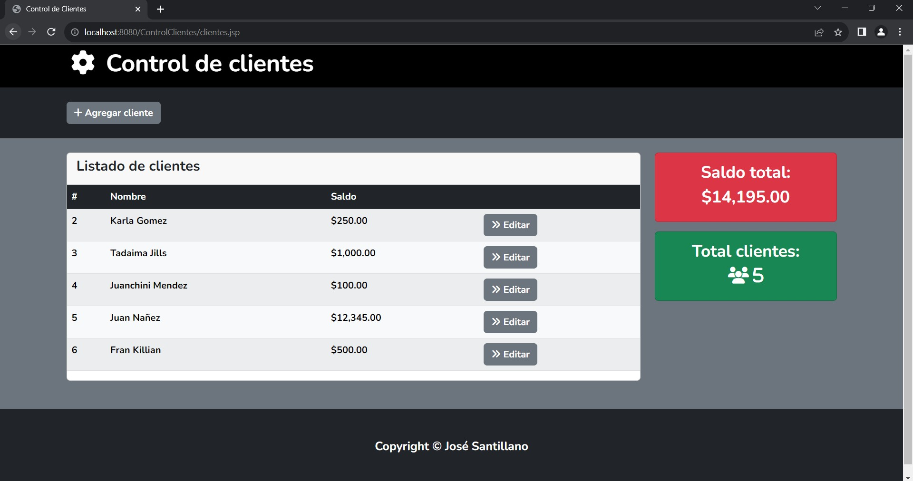
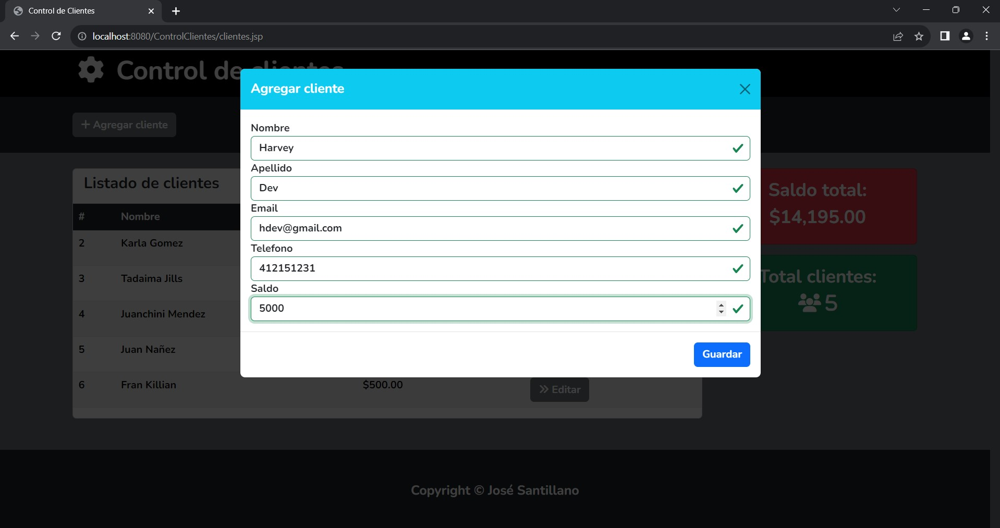
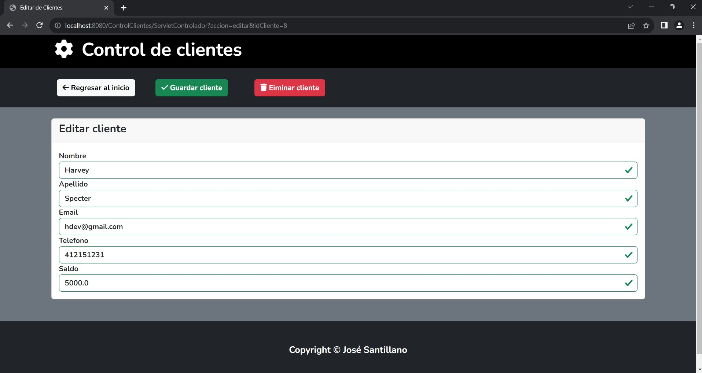

#  Sistema de Control de Clientes en Java con MySQL
## Descripción del proyecto

Aplicación para el control y manejo de clientes en Java 
(CRUD), utilizando JSF, JSP, Servlets, Persistence, 
Thymeleaf, CSS, Bootstrap, Font-Awesonme y MySQL.

## Funcionalidad

La funcionalidad radica en un CRUD sencillo para administrar
la creación, edicion, eliminación y visualización de los
clientes.

### Ver clientes


### Agregar clientes


### Editar o eliminar clientes


## Requerimientos

### Glassfish 7.0.0
Se requiere el servidor de Glassfish para la ejecución
del proyecto.
````java
    url: https://www.eclipse.org/downloads/download.php?file=/ee4j/glassfish/web-7.0.7.zip
````
